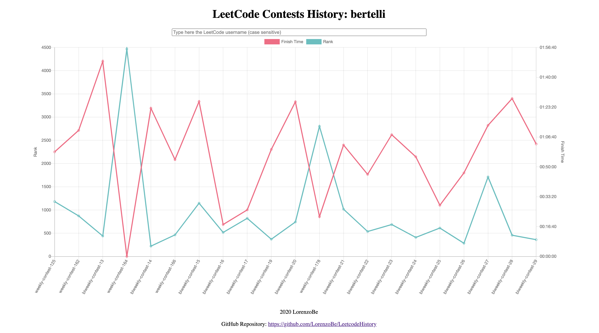

# LeetcodeHistory
This is a project to generate the users contest history of LeetCode platform.  
LeetCode doesn't allow users to visualise a meaningful history of the contests which they joined. Without this history it's difficult to keep track of the learning progresses and quickly navigate back to the difficult contests.  
The target is to acquire the data from LeetCode site and present a "nice to see" and "easy to use" graph to fill the gap.  
The application is published on Azure at the following URL: [https://leetcodehistory.azurewebsites.net/](https://leetcodehistory.azurewebsites.net/)  
This is how it currently appers:  


## Solution design
### Data size
The final design need to consider these numbers:
- Number of LeetCode users: ~110K, growing
- Number of contests: 195 weekly + 28 bi-weekly
- Number of users per contest: < 15K
- Data to be stored for each contest partecipation: contest ID (4 bytes), timestamp (4 bytes), rank (4 bytes), score (1 byte), finish time (< 2 hours, 2 bytes expressing it in seconds) -> 15 bytes

We can consider in average that each user joined 50 contests:  
key = 255B * 110K ~ 29 MB  
values = 15B * 50 * 110K ~ 83 MB  
The total is about 120 MB, not so huge.  

### Bandwidth
The backend service will be a read heavy service. The data can be updated once a week by an administration script. We can estimate a spike of 15K users in the hour just after a contest. To find the QPS:  
READ QPS = 15K / 60 minutes / 60 seconds = 4.2 QPS  

The data retrieved by each user is the complete contest history, so:  
READ BW = 4.2 QPS * 15B * 50 = 3150 B/s = 26 Kbit/sec  

### Storage
We could use an RDBMS database, maybe in master-slave configuration to improve read capabilities and availability. We don't need strict consistency between the two nodes. We could have just two tables: User and Contest. Contest could contain about 5 millions of records.  
On the other hand, we don't need to do complex queries on data, we just need the contests results of a single user to visulise them into a graph. A key-value storage with possibility of setting complex values structure (multicolumn, nested types) is probably enough.  
Since there are no additional constrains, the availability of the storage types on Cloud providers, the costs, the integration effort and the "it's cool :D" factor will be taken into consideration.  

#### Redis storage
Some preliminary tests can be executed on Redis storage. It is available on Azure and it can be easily integrate with Python scripts. [This](https://docs.microsoft.com/en-us/azure/azure-cache-for-redis/cache-python-get-started) is a good starting point to learn more.
The VisualStudioProfessional Azure subscription includes 50 CHF/months. A Redis Cache instance with 250 MB on Azure is below this cost and it should be enought for the initial tests.  
I think to start with a simple configuration where the LeetCode UserID will be the key and the single contests results will be stored into a **list** data type. More information about the Pythonic way to manage Redis lists [here](https://pythontic.com/database/redis/list).  
Since Redis doesn't support nested types, the single contest results will be encoded in JSON format, like:
```
user:1: [{"contestId": "1", "timestamp": "1111111111", "finishTime": "666", "score": "12", "rank": "888" },
         {"contestId": "2", "timestamp": "2222222222", "finishTime": "777", "score": "23", "rank": "999"}]
```

### Graph visualisation
I don't have a big experience on data visualisation, so I will choose the first open source and well documented JavaScript library: [Chart.js](https://www.chartjs.org/).  

## Application
To efficiently write data to the Redis storage, the crawler script that will get data from LeetCode need to be as near as possible to the storage.
I chose to create an Azure WebApp, written in Python 3. Inside it I can have two rest endpoints: one public to present the data and one private (password protected) to manage the updates on Redis.  
It's very easy to create a Python app on Azure, [here is an example](https://docs.microsoft.com/en-us/azure/app-service/containers/quickstart-python?tabs=bash).  
I started from this example and extended for my purposes. The required Python package are listed in **requirements.txt** file, while the REST server is defined into **application.py** file (it uses Flask as WebService).  
It is very easy to test it on localhost using the following commands:  
```
python3 -m venv venv
source venv/bin/activate
pip install -r requirements.txt
export FLASK_APP=application.py
flask run
```
The Redis storage need to be manually created using an Azure subscription.  
There are also some parameters that need to be set in a config file: Redis hostname and key, administrator user and password (will be used for the basic authentication of the private part of WebApp). I created the **config-sample.ini** file, it needs to be populated and renamed to **config.ini**.  
Once locally tested, the WebApp can be deplyed on Azure. the easiest way to start is using the [Azure Command-Line Interface](https://docs.microsoft.com/en-us/cli/azure/?view=azure-cli-latest):
```
az login
az webapp up --sku F1 -n <app-name>
```

There is one important notice about how the Flask service is deplyed on Azure Web App. For production deployement, it's recommended to deploy Flask with just a single working thread. This means that it must serialise all requests. This is particulary bad in this project because the request which updates the storage with a new contest takes a lot of time (~1 min).  
On Azure Flask is deployed using [Gunicorn](https://docs.gunicorn.org/en/stable/settings.html), which should support multiple workers, but I observed that it was not possible to execute requests in parallel.  
After a lot of investigations I found that we can specify the Gunicorn starting parameters simply uploading a **startup.txt** file aside the others adn referring to it in the Azure Web App configuration, as described in [Configure a custom startup file for Python apps on Azure App Service](https://docs.microsoft.com/en-us/azure/developer/python/tutorial-deploy-app-service-on-linux-04).  
I logged into the Azure Portal, opened the SSH console of the Web App, found the script which is starting Gunicorn and extended the parameters with the **workers** option. This is the content of my **startup.txt** file:  
```
GUNICORN_CMD_ARGS="--timeout 600 --access-logfile '-' --error-logfile '-' --bind=0.0.0.0:8000 --chdir=/home/site/wwwroot --workers=4" gunicorn application:app
```

For the visualisation, Chart.js revealed to be a very powerful and extendible engine. I had to write custom callbacks in the configuration to create redirection to the contests when users click on one point in the graph. I also had to extend tooltips and axis to write the labels with time formatting. All the points where however solved thanks to the good documentation and huge community behind the project.

## Maintenance
The biggest problem of maintaining all the data in a Redis storage is that it is not persisted bu default. In azure there is the option to spend more and have the possibility to import/export data, persiste it on file system, server redundancy. Unfortunately I am a poor developer :D so I had to invent something to manage the server reboots, without having to spend too much (the price rises from 15 $/month to 400 $/month for the possibility to import/export).  
I really tried hard to find a way to export or save the data: both the SAVE Redis command and the '--rdb' option of [redis-cli](https://redis.io/topics/rediscli) are disabled.  
At the end I figured out the most simple way: read all the keys and dump them into a file. There wa however an uknown point about the performances, especially because the redis server on Azure is not hosted in the same machine of the Web App.  
Lukily Redis supports [pipelines](https://redis.io/topics/pipelining) as a way to aggregate multiple commands (it even support transactions). Using pipelines and the smart binary serialisation of Python [pickle](https://docs.python.org/3/library/pickle.html) I was able to export 120 MB in less than one minute and re-import it in about 15 seconds. Enought to give it a try.  
I then extended the available Web App API commands so I can remotely trigger some import/export. But there was still the problem to identify when the Redis server is rebooted (I suppose this could happen in any moment that Azure Sytem Administrators will need to reboot/move/update the hosting machine). I chose the following lazy logic, embedded in the main call to get the user contests data:
* User requests the main Web App page, which trigger the read of the user contests data from Redis
* If the Redis storage is empty, the last backup is imported and then the data is returned (yes, there could be an unluky user that will need to wait 15 seconds before seeing the data)
The probelm now is the concurrency: how to be sure that other users will not do the same update at the same time? I am trying to manage it using a lock on Redis itself: if the user is able to acquire the lock he will start also the import, while other users will get an error if trying to access at the same time. I implemented the lock as described [here](https://redis.io/topics/distlock#:~:text=The%20simplest%20way%20to%20use,resource%2C%20it%20deletes%20the%20key.).  

## How to use it
You can insert the username in the main textbox and press Enter. Then everything should magically work. You can also pass the username as GET propery like: [https://leetcodehistory.azurewebsites.net/?username=beet](https://leetcodehistory.azurewebsites.net/?username=beet).  
The contest upload is still manually triggered by me, I plan to automatise it to run every Monday. Not all contests has been upladed: unfortunately the LeetCode API seems to work just starting from weekly contest 60.  

## Improvements
There are a lot of improvements, any help is welcome:
* Improve usability on touch systems: it's a little triky to show the tooltips on touch systems as well as precisely tap to follow the link
* Add horizontal zoom + pan
* Add a timer based Azure function/chron process to trigger the add of latest contests
* When a click on a contest, redirect the user to the exact ranking page (currently it is always the first page)

Thank you all and enjoy!
